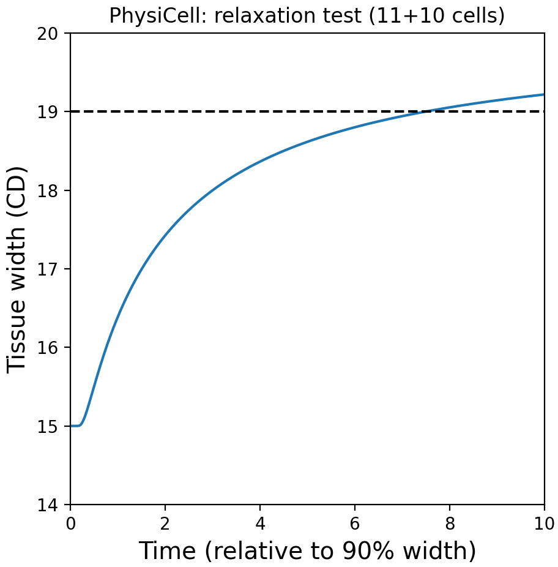

# PhysiCell model for a growing monolayer (an OpenVT reference model)

```
(base) M1P~/git/mechanics_relaxation$ make load PROJ=cells11_final
(base) M1P~/git/mechanics_relaxation$ make 
(base) M1P~/git/mechanics_relaxation$ project  
or:
(base) M1P~/git/mechanics_relaxation$ pcstudio  

(base) M1P~/git/mechanics_relaxation$ python analysis/plot_11cells_crop.py 88
(generates pc_plot_11cells.csv)
```


```
- assuming we have Chaste's results
(base) M1P~/git/mechanics_relaxation$ python analysis/plot_11cells_csv.py pc_plot_11cells.csv
```


```
(base) M1P~/git/mechanics_relaxation$ python analysis/plot_21cells_crop.py 1440
(generates pc_plot_21cells_width.csv)
```


## Funding

National Science Foundation 2303695 and National Cancer Institute 1U24CA284156-01A1

